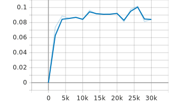

### Project overview
The goal of this project is to create a machine learning model to detect objects in images relevant to the operation of an autonomous vehicle.
This project will utilize TensorFlow and the [Waymo Open dataset](https://waymo.com/open/) to create and train the model.
Object detection is a foundational element of creating an autonomous vehicle. It is necessary in order to build an accurate recreation of the environment.
Without knowing what objects exist in an environment, it is completely impossible for a vehicle to navigate it safely.
Check out [vid](experiments/rcnnAug2/videos/animationTest.mp4) to see the final results of the training.

### Set up
Create a docker container by following the instructions from the [README](build/README.md) in the build folder.

### Dataset
#### Dataset analysis
The dataset being used contains 100 tfrecords, with a total of 1997 images. These images contain a total of 35673 
vehicles, 10522 pedestrians, and 270 cyclists. 

The images contain various environments such as bustling cities, emtpy
residential areas, and highways. There are also pictures in different conditions ranging from a clear sunny day to 
in the dark of night to stormy weather.

#### Cross validation
For the purpose of cross validation, the data was split into 3 sets. 85% of the tfrecords were used for training. 10% were used for validation during training.
5% were kept as test data to evaluate the model after training was complete. Validation and training data need to be 
separate to avoid overfitting. A separate test set was constructed to check for data leakage. (If the validation set 
greatly outperforms the test set, it is likely that through our experimentation, information has leaked from the validation set into the model.)

### Training
#### Reference experiment

This experiment fine-tuned a version of SSD-Resnet that had been pretrained on the COCO 2017 dataset.
Although it seemed to make progress and improved over the training, this model never became particularly good. It only reached a 
mAP of .016, and had issues detecting objects especially in images with many to detect.

#### Improve on the reference
This experiment fine-tuned a version of Faster-RCNN-Resnet that had been pretrained on the COCO 2017 dataset. By using faster-rcnn
rather than ssd, this model sacrificed speed for the sake of performance. This model was also trained for significantly more steps.
Perhaps the most important improvement made to the model was adding image augmentation to increase the diversity of the training
data in a way that mimics what might be observed in the real world. Things like shifting from rgb to gray and adjusting 
the brightness can mimic an overcast or foggy day or even a night. Adding in black boxes can mimic minor obstructions like
bushes or trees. This model performed significantly better reaching a mAP of .084. It seems to have plateaued so training for more
epochs would be unlikely to lead to any sort of significant improvement.
The final version is in the experiments/rcnnAug2 directory.

Below is a comparison between the reference model and improved model:
##### Reference

##### Improved

### Conclusion
The model became reasonably good at detecting and classifying both pedestrians and vehicles. However, there were so few cyclists in the 
data that the model never began to detect them. In order to address this, we would need to train the model with more images with more
cyclists. However, regardless of how many images we could train on, it is unlikely that computer vision alone would be sufficient for object detection in an
autonomous vehicle.